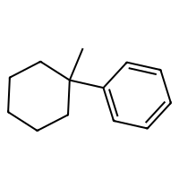

# Minimal VAE on SELFIES




SELFIES are a robust and discrete representation of molecules[^1], which are a sort of successor to SMILES[^2]. This repository contains a minimal working example of an MLP variational autoencoder that can be trained on SELFIES, including how to download a database of SELFIES strings, how to process these as categorical data, the training loops, and an analysis of the resulting latent space.

## Prerequisites

This code was written with Python 3.9 in mind. If you are using Conda, try

```sh
conda create -n minimal-vae-on-selfies python=3.9
```

following with

```sh
pip install -r requirements.txt
```

This `requirements.txt` file includes `RDKit`, which might be tricky to install depending on your OS. Make sure everything is setup properly by running

```
python -c "import rdkit; print(rdkit.__version__)"
```

If you run into trouble, [check RDKit's documentation here](https://www.rdkit.org/docs/Install.html).

You should add the `src/` file to your **PYTHONPATH**. If you're using VSCode for running and debugging, this can be done by adding this key-value pair to your `launch.json` :
```json
"env": {
    "PYTHONPATH": "${workspaceFolder}${pathSeparator}src:${env:PYTHONPATH}"
}
```

## Data preprocessing

In `src/data_preprocessing` you can find files for downloading the dataset (which is PubChem's `CID-SMILES` saved at `ftp://ftp.ncbi.nlm.nih.gov/pubchem/Compound/Extras/CID-SMILES.gz`) and processing it to a small dataset of 5000 SELFIES strings in `data/processed/TINY-CID-SELFIES-20`, which is **already available in the repo**.

If you want access to the other datasets (for, say, a larger training run), you can run the following scripts. **Warning:** you will need plenty of disk space since the uncompressed CID-SMILES is already 8Gb.

- `download_dataset.py` lets you download the dataset and decompress it.
- `smiles_to_strings.py` reads the file at `data/raw/CID-SMILES` in chunks and progressively translates the SMILES to SELFIES using The Matter's Lab translator.[^3] Each processed chunk is appended at the end of a CID-SELFIES file in `data/processed/CID-SELFIES`.
- `small_selfies.py` filters all the SELFIES in the dataset that are larger than 20 tokens, outputting a file in `data/processed/SMALL-CID-SELFIES-20`. Finally, a subset of only 50000 of these 20-length SELFIES is stored in `data/processed/TINY-CID-SELFIES-20`, which is the file used for training. However, the models and training pipeline are built in such a way that training on the entire `SMALL-CID-SELFIES-20` should be feasible with a little bit of work.[^4]

This figure shows the size of these datasets **in log-scale**.


Ideally, we would also include other datasets like ZINC20[^5], or GuacaMol[^6].

## Tokenizing

The tokenizing is done *by hand*. The script `src/tokenizing/compute_tokens.py` takes a database name (like `TINY-CID-SELFIES-20`) and computes a `tokens_dict: Dict[str, int]` and saves it inside `data/processed/tokens_TINY-CID-SELFIES-20.json`. We define the tokens as all the substrings in a SELFIES between square brackets:

```python
# From src/utils/tokens.py
def from_selfie_to_tokens(selfie: str) -> List[str]:
    """
    Given a selfie string, returns a list of all
    occurences of [.*?] in the string (i.e. whatever
    is between square brackes).
    """
    return list(re.findall(r"\[.*?\]", selfie))
```

**This doesn't scale**. Smarter tokenizers are available out there. For example, check [MolGen](https://huggingface.co/zjunlp/MolGen-large).


## Model's definition

We implement a simple MLP Variational Autoencoder. 

```python
# Inside the model's definition in src/models/vae.py

# Define the input length: length of a given SELFIES
# (always padded to be {max_length}), times the number of tokens
self.input_length = max_token_length * len(self.tokens_dict)

# Define the model
self.encoder = nn.Sequential(
    nn.Linear(self.input_length, 1024),
    nn.ReLU(),
    nn.Linear(1024, 512),
    nn.ReLU(),
    nn.Linear(512, 256),
    nn.ReLU(),
)
self.encoder_mu = nn.Linear(256, latent_dim)
self.encoder_log_var = nn.Linear(256, latent_dim)

# The decoder, which outputs the logits of the categorical
# distribution over the vocabulary.
self.decoder = nn.Sequential(
    nn.Linear(latent_dim, 256),
    nn.ReLU(),
    nn.Linear(256, 512),
    nn.ReLU(),
    nn.Linear(512, 1024),
    nn.ReLU(),
    nn.Linear(1024, self.input_length),
)
```

After running `src/training/training_models.py`, a trained model is saved in `data/trained_models/VAESelfies_TINY-CID-SELFIES-20.pt` ([download it here](https://drive.google.com/file/d/1aAQ5z9EcuPzgep2lFQL-lJzSvUpCnPG_/view?usp=share_link)).

**This model is nowhere close to state-of-the-art**. The goal of this code is to have a toy latent space to run experiments in, or to have a starting point for your new SOTA models!

## Some random samples

 The script in `src/exploration/explore_latent_space.py` samples randomly from its latent space. Some of those are at the beginning of this repository.


## Some TO-DOs

- [ ] Latent space optimization using CMA-ES and BO.
- [ ] Include other datasets, like GuacaMol or ZINC20.
- [ ] Better models, like an autoregressive VAE using LSTMs, or a transformer.
- [ ] Scalable tokenizing using MolGen's tokenizer.

## Cite this repository!

If you find this code useful, feel free to cite it!

```bibtex
@software{Gonzalez-Duque:VAESelfies:2023,
author = {González-Duque, Miguel},
title = {{Minimal implementation of a Variational Autoencoder on SELFIES representations of molecules}},
url = {https://github.com/miguelgondu/minimal_VAE_on_selfies},
version = {0.1},
date = {2023-05-02}
}
```

[^1]: https://pubmed.ncbi.nlm.nih.gov/36277819/
[^2]: https://pubs.acs.org/doi/10.1021/ci00057a005
[^3]: https://github.com/aspuru-guzik-group/selfies
[^4]: We would need a smarter tokenizer, like the one provided by [MolGen](https://huggingface.co/zjunlp/MolGen-large). We'd also need to do better with the memory management.
[^5]: https://pubs.acs.org/doi/10.1021/acs.jcim.0c00675
[^6]: https://pubs.acs.org/doi/10.1021/acs.jcim.8b00839
